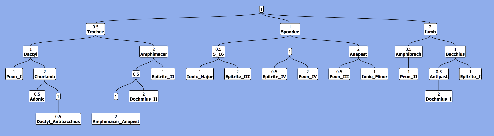

# `treeplotter`
I wasn't a huge fan of any of the available methods for tree plotting in Python. This package aims to make this easier. It wraps the TreantJS library to plot python Tree objects and saves them to a rendered HTML file. This HTML file can then be optionally exported as a high-res PNG by wrapping Rs ``webshot`` package.

### Usage
This library has `Node` and `Tree` classes in the `treeplotter.tree` module. `Node` objects (currently) store a value and a name (string or `None`). We can then specify the nodes children and parent. A `Tree` is then defined by a root. We can then write an image of this tree (rendered by TreantJS) to an HTML file and save it to PNG via webshot. See `Tutorial.md` to see how it is used. 

This package is used in the `decitala` package (see [here](https://github.com/Luke-Poeppel/decitala)) to make `FragmentTree` diagrams, like the following one:


### MacOS Installation
**Disclaimer**
I haven't tested this on anything other than MacOS (Big Sur). If you find this install works (or doesn't!) on other platforms, please file an issue or a Pull Request. 

This package requires a few installs. Sorry. Hopefully it's worth it. If all works, you should be able to copy-paste these commands into command line. 

1. Install homebrew:
```
/bin/bash -c "$(curl -fsSL https://raw.githubusercontent.com/Homebrew/install/HEAD/install.sh)"
```
2. Install `imagemagick`:
```
brew install imagemagick
```
3. Install `phantomJS`
```
brew tap homebrew/cask
brew cask install phantomjs
```
4. Install `R`:
```
brew install r
```
5. Install `webshot`
```
Rscript installPkgs.R "webshot"
```