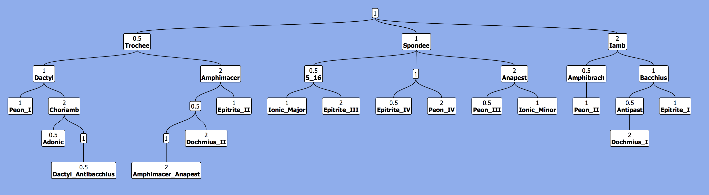

# `treeplotter`
[](https://github.com/Luke-Poeppel/treeplotter/actions)


Tree plotting is really hard in Python. This package aims to make the process easier. It wraps the TreantJS library to plot trees and saves them to a rendered HTML file. This HTML file is then also exported to a high-res PNG by wrapping R's ``webshot`` package. The package requires some complicated installs, but this is the price to pay to not use any R, Javascript, or CSS ;)

### Usage
This library has `Node` and `Tree` classes in the `treeplotter.tree` module. `Node` objects store a value and a name (string or `None`). We can then specify the nodes children and parent. A `Tree` is then defined by a root node. We can then create a tree visualization. See `Tutorial.md` for a complete demo. 

This package is used in the `decitala` package (see [here](https://github.com/Luke-Poeppel/decitala)) to make `FragmentTree` diagrams, like the following one of the Greek Prosodic Feet:


### MacOS Installation
**To plot any tree diagrams, you must follow these instructions!**
I've only tested this on MacOS (Big Sur 11.2.2 and Catalina 10.15). If you find this install doesn't work on other versions and OSs, please file an Issue or a Pull Request! This package requires some complicated installs. Sorry. Hopefully it's worth it. This package requires:
1. `homebrew`
2. `imagemagick`
3. `node`
4. `browserify`
5. `phantomJS`
6. `R`
7. `webshot`

You are free to install these packages on your own. For simplicity, however, I've created a MacOS installation assistant that will install the packages for you. First install this package with:
```
$ pip3 install treeplotter
```
Then run the installation assistant with:
```
$ treeplotter install-assist
```

### Troubleshooting
If you're running MacOS and see issues related to R installation, it may help to add the following to your `.zshrc`:
```
export PATH=$PATH:/Library/Frameworks/R.framework/Resources
```